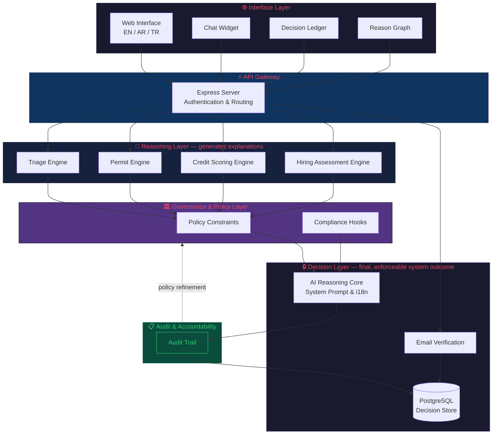

# OpLogica™ — System Architecture

> Reference document for the architectural design of the OpLogica Platform.
> For citation: Ibrahim, M. (2025). *OpLogica: Operational Proof Standard for Verifiable Intelligence.* Zenodo. [10.5281/zenodo.17275281](https://doi.org/10.5281/zenodo.17275281)

---

## Overview

OpLogica separates **reasoning** from **decision-making** by design. Every system output passes through five distinct layers, each with a defined responsibility. This ensures that no outcome is produced without explanation, no explanation is accepted without policy validation, and no decision is recorded without an auditable trail.

---

## Architecture Diagram

---

## Layer Descriptions

### 1. 🌐 Interface Layer

The user-facing layer responsible for presenting information and collecting input across three languages (English, Arabic, Turkish).

| Component | Role |
|-----------|------|
| **Web Interface** | Primary multilingual UI for all platform interactions |
| **Chat Widget** | Conversational interface for AI-assisted verification queries |
| **Decision Ledger** | Transparent log of all system decisions with reasoning traces |
| **Reason Graph** | Visual representation of logical dependencies behind each decision |

### 2. ⚡ API Gateway

Centralized entry point handling authentication, session management, and request routing. All client requests pass through this layer before reaching any engine.

### 3. 🧠 Reasoning Layer

Domain-specific engines that **generate explanations and analysis** for each input. These engines interpret data and produce structured reasoning — but they do not make final decisions.

| Engine | Domain |
|--------|--------|
| **Triage Engine** | Initial request classification and routing |
| **Permit Engine** | Building and operational permit verification |
| **Credit Scoring Engine** | Financial creditworthiness assessment |
| **Hiring Assessment Engine** | Employment candidate evaluation |

### 4. 🏛️ Governance & Policy Layer

The institutional control layer that **applies policy constraints and compliance checks** before any reasoning output becomes a decision. This layer ensures outputs conform to regulatory, ethical, and organizational standards.

| Component | Role |
|-----------|------|
| **Policy Constraints** | Enforces domain-specific rules and institutional policies |
| **Compliance Hooks** | Validates outputs against regulatory and ethical requirements |

### 5. 🔒 Decision Layer

Produces **final, enforceable system outcomes**. Only outputs that have passed through both Reasoning and Governance layers reach this stage.

| Component | Role |
|-----------|------|
| **AI Reasoning Core** | Central intelligence unit with system prompts and internationalization |
| **Email Verification** | Identity confirmation for authenticated decisions |
| **PostgreSQL Decision Store** | Persistent, queryable record of all verified decisions |

### 6. 📋 Audit & Accountability

Records every decision for institutional accountability. The Audit Trail feeds back into the Governance Layer, enabling **continuous policy refinement without model retraining** — a core principle of the Proof-of-Reason Standard.

---

## Key Design Principles

| Principle | Implementation |
|-----------|---------------|
| **Separation of Reason and Decision** | Reasoning engines generate explanations; the Decision Layer validates and enforces outcomes |
| **Policy Before Decision** | No output becomes a decision without passing Governance checks |
| **Auditability by Default** | Every decision is recorded with its full reasoning trace |
| **Continuous Refinement** | Audit findings feed back to Governance without requiring model retraining |
| **Multilingual by Design** | All layers support EN, AR, and TR from the ground up |

---

## Technology Stack

| Layer | Technology |
|-------|-----------|
| Frontend | HTML5, CSS3, JavaScript |
| Backend | Node.js, Express |
| Database | PostgreSQL |
| AI Core | LLM Integration with structured system prompts |
| Authentication | Session-based with email verification |
| Internationalization | JSON-based i18n (EN, AR, TR) |

---

*This document is part of the OpLogica™ Platform. Licensed under Apache 2.0.*
*© 2025 Mohamed Ibrahim, Sovereign Systems Architecture (OpLogica™ Project)*
