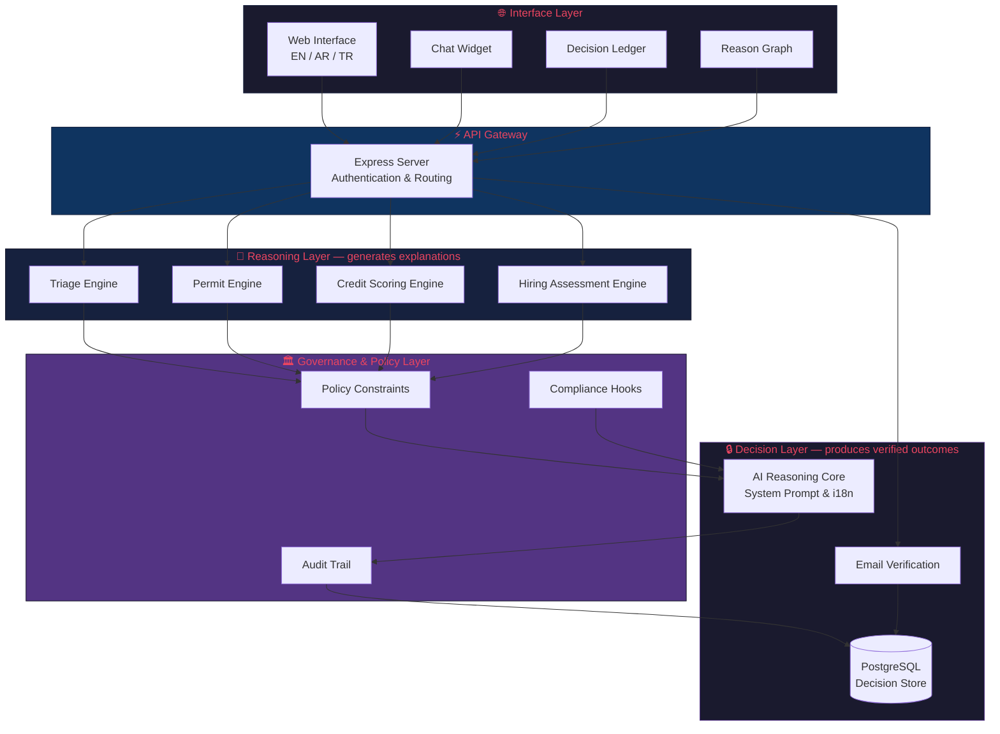

# OpLogica™ — The Operational Proof Standard for Verifiable Intelligence

AI Verification, Decision Intelligence & Institutional Accountability Systems.

Building trust infrastructure for the next era of AI governance.

## Architecture

### Legend

| Symbol | Meaning |
|--------|---------|
| 🧠 **Reasoning Layer** | Generates explanations and analysis for each input |
| 🏛️ **Governance Layer** | Applies policy constraints and compliance checks |
| 🔒 **Decision Layer** | Produces verified, auditable outcomes stored on record |

> **Reasoning ≠ Decision:** The Reasoning Layer generates interpretations and explanations. The Decision Layer validates, records, and makes outcomes auditable. This separation ensures every output is both explainable and verifiable.

## About

OpLogica™ is a global research and verification framework uniting logic, ethics, and computation into a single, auditable architecture of reason. It establishes the world's first **Proof-of-Reason Standard**, where every digital decision becomes a verifiable act of logic, transparency, and moral accountability.

## Official Domains

- 🟢 [oplogica.com](https://oplogica.com) — Institutional interface & applied deployments
- 🔵 [oplogica.ai](https://oplogica.ai) — AI verification & intelligence systems
- 🟣 [oplogica.org](https://oplogica.org) — Research portal & public knowledge repository
- 🔗 [oplogica.net](https://oplogica.net) — Operational verification network
- 🟡 [oplogica.io](https://oplogica.io) — Developer API & integration hub
- 🔴 [oplogica.info](https://oplogica.info) — Documentation & public resources

## Research & Publications

- 📄 Zenodo DOI: [10.5281/zenodo.17275281](https://doi.org/10.5281/zenodo.17275281)
- 💻 Code Ocean: [Reproducible Capsules](https://codeocean.com/capsule/8676805)

## License

Licensed under the [Apache License 2.0](./LICENSE).

Copyright © 2025 Mohamed Ibrahim, Sovereign Systems Architecture (OpLogica™ Project)
