# OpLogica™ — The Operational Proof Standard for Verifiable Intelligence

AI Verification, Decision Intelligence & Institutional Accountability Systems.

Building trust infrastructure for the next era of AI governance.

## Architecture

```mermaid
graph TB
    subgraph Client["🌐 Client Layer"]
        UI[Web Interface<br/>EN / AR / TR]
        Chat[Chat Widget]
        Ledger[Decision Ledger]
        Graph[Reason Graph]
    end

    subgraph API["⚡ API Gateway"]
        Server[Express Server<br/>Authentication & Routing]
    end

    subgraph Engines["🧠 Verification Engines"]
        Triage[Triage Engine]
        Permit[Permit Engine]
        Credit[Credit Scoring Engine]
        Hiring[Hiring Assessment Engine]
    end

    subgraph Core["🔒 Core Services"]
        AI[AI Reasoning Layer<br/>System Prompt & i18n]
        Email[Email Verification]
        DB[(PostgreSQL<br/>Decision Store)]
    end

    UI --> Server
    Chat --> Server
    Ledger --> Server
    Graph --> Server
    Server --> Triage
    Server --> Permit
    Server --> Credit
    Server --> Hiring
    Triage --> AI
    Permit --> AI
    Credit --> AI
    Hiring --> AI
    AI --> DB
    Server --> Email
    Email --> DB

    style Client fill:#1a1a2e,stroke:#16213e,color:#e94560
    style API fill:#0f3460,stroke:#16213e,color:#e94560
    style Engines fill:#16213e,stroke:#1a1a2e,color:#e94560
    style Core fill:#1a1a2e,stroke:#533483,color:#e94560
```

## About

OpLogica™ is a global research and verification framework uniting logic, ethics, and computation into a single, auditable architecture of reason. It establishes the world's first **Proof-of-Reason Standard**, where every digital decision becomes a verifiable act of logic, transparency, and moral accountability.

## Official Domains

- 🟢 [oplogica.com](https://oplogica.com) — Institutional interface & applied deployments
- 🔵 [oplogica.ai](https://oplogica.ai) — AI verification & intelligence systems
- 🟣 [oplogica.org](https://oplogica.org) — Research portal & public knowledge repository
- 🔗 [oplogica.net](https://oplogica.net) — Operational verification network
- 🟡 [oplogica.io](https://oplogica.io) — Developer API & integration hub
- 🔴 [oplogica.info](https://oplogica.info) — Documentation & public resources

## Research & Publications

- 📄 Zenodo DOI: [10.5281/zenodo.17275281](https://doi.org/10.5281/zenodo.17275281)
- 💻 Code Ocean: [Reproducible Capsules](https://codeocean.com/capsule/8676805)

## License

Licensed under the [Apache License 2.0](./LICENSE).

Copyright © 2025 Mohamed Ibrahim, Sovereign Systems Architecture (OpLogica™ Project)
